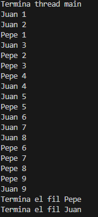
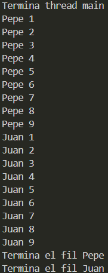
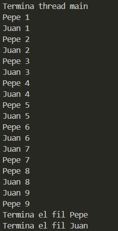

# M9 UF2 Act1 Daniel Acosta Garcia
## Comportament 1
En el primer comportamiento, lo que había que hacer era que dos Fil se ejecutaran de manera simultánea, pero no en un orden específico.
Lo que he hecho es crear los Fil con el constructor al que le pasó el nombre para el Fil. Los inicios y ellos solos ya se van ejecutando por el run y se van mostrando por pantalla. Cuando termina uno de ellos, el main se muestran por pantalla.
#### Principal:
``` java
public class Principal {
    public static void main(String[] args) {
        Fil filJuan = new Fil("Juan");
        Fil filPepe = new Fil("Pepe");
        filJuan.start();
        filPepe.start();
        System.out.println("Termina thread main");
    }
}
```
### Fil:
``` java
public class Fil extends Thread {
    private String nom;
    public Fil(String nom) {
        this.nom = nom;
    }
    @Override
    public void run() {
        for (int i = 0; i <= 9; i++) {
            System.out.printf("%s %d \n", nom, i);
        }
        System.out.println("Termina el fil " + nom);
    }
}
```
### Execusio:


## Comportament 2
En el primer comportamiento, lo que había que hacer era que los dos Fil se ejecutaran de manera no simultánea, ya que se tiene que ejecutar uno y después el otro.
Lo que he hecho es crear los Fil con el constructor al que le pasó el nombre para el Fil. Los inicios y ellos solos ya se van ejecutando por el run y se van mostrando por pantalla. Cuando termina uno de ellos, el main se muestran por pantalla.
Los cambios que he hecho en comparación del primero son agregar un setPriority a cada uno de los Fil para que se ejecute primero uno y después el otro gracias al orden de prioridad. 
### Principal:
``` java
public class Principal {
    public static void main(String[] args) {
        Fil filJuan = new Fil("Juan");
        Fil filPepe = new Fil("Pepe");
        filJuan.setPriority(10);
        filPepe.setPriority(1);
        filPepe.start();
        filJuan.start();
        System.out.println("Termina thread main");
    }
}
```
### Fil:
``` java
public class Fil extends Thread {
    private String nom;
    public Fil(String nom) {
        this.nom = nom;
    }
    @Override
    public void run() {
        for (int i = 1; i <= 9; i++) {
            System.out.printf("%s %d \n", nom, i);
        }
        System.out.println("Termina el fil " + nom);
    }
}
```
### Execusio:



## Comportament 3
En el primer comportamiento, lo que había que hacer era que los dos Fil se ejecutaran de manera simultánea y en un orden específico, cada vez uno cada uno.
Lo que he hecho es crear los Fil con el constructor al que le pasó el nombre para el Fil. Los inicios y ellos solos ya se van ejecutando por el run y se van mostrando por pantalla. Cuando termina uno de ellos, el main se muestran por pantalla.
Los cambios que he hecho en comparación del segundo son los setPriority poner el mismo valor para que se ejecuten a la vez en prioridad y poner un sleep en el fichero de Fil para que cuando se vaya a sleep una se ponga a ejecutarse, la otra de esta manera va haciendo de manera continua. 
### Principal:
``` java
public class Principal {
    public static void main(String[] args) {
        Fil filJuan = new Fil("Juan");
        Fil filPepe = new Fil("Pepe");
        filJuan.setPriority(1);
        filPepe.setPriority(1);
        filPepe.start();
        filJuan.start();
        System.out.println("Termina thread main");
    }
}
```
### Fil:
``` java
public class Fil extends Thread {
    private String nom;
    public Fil(String nom) {
        this.nom = nom;
        setName(nom);
    }
    @Override
    public void run() {
        for (int i = 1; i <= 9; i++) {
            System.out.printf("%s %d \n", nom, i);
            try {
                Thread.sleep(100);
            } catch (InterruptedException e) {
                e.printStackTrace();
            }
        }
        System.out.println("Termina el fil " + nom);
    }
}
```
### Execusio:
