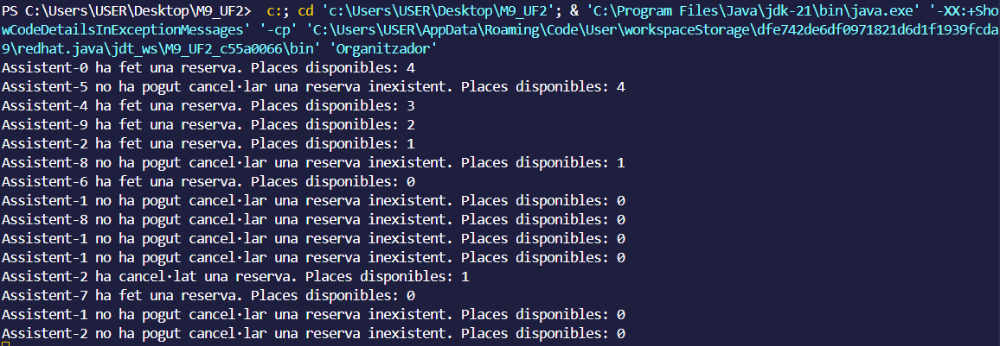
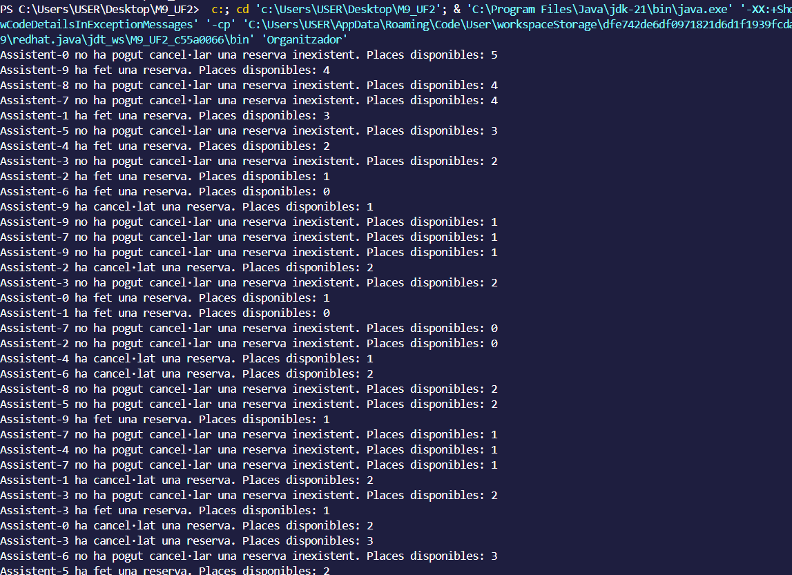
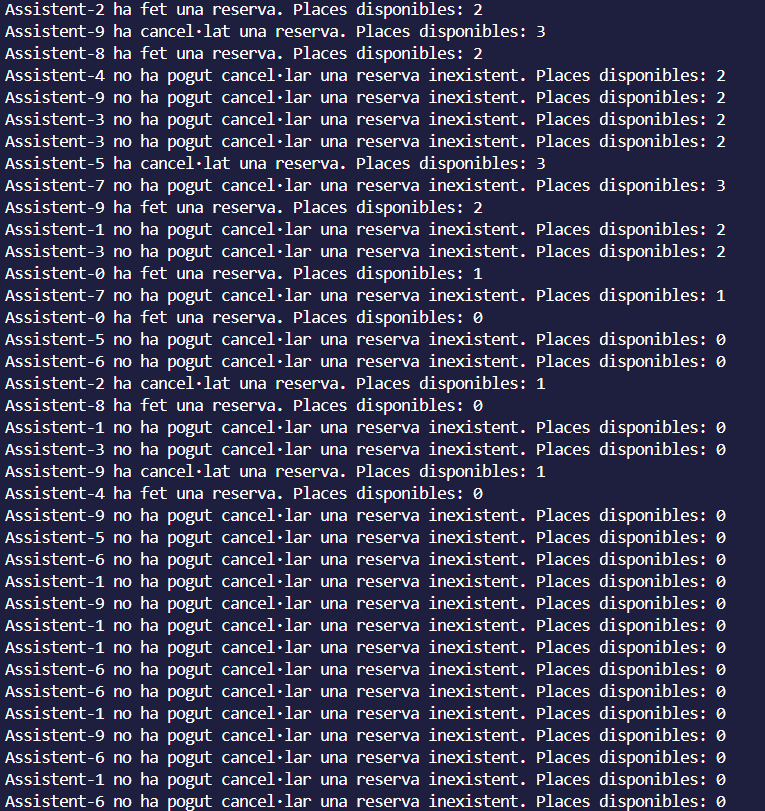

1. Per què s'atura l'execució al cap d'un temps? 
Estan tots els fills esperant pero ningun esta notificant.

2. Què passaria si en lloc de una probabilitat de 50%-50% fora de 70% (ferReserva)-30% 
(cancel·lar)? I si foren al revés les probabilitats?
70%:
Assistent:
...
    public void run() {
        try {
            while (true) {
                double probabilitat = random.nextDouble();
                if (probabilitat < 0.7) {
                    esdeveniment.ferReserva(this);
                } else {
                    esdeveniment.cancelaReserva(this);
                }
                Thread.sleep(random.nextInt(1000));
            }
        } catch (InterruptedException e) {
            e.printStackTrace();
        }
    }

-----------------------------------------------------------
30%:
Assistent:
...
    public void run() {
        try {
            while (true) {
                double probabilitat = random.nextDouble();
                if (probabilitat < 0.3) {
                    esdeveniment.ferReserva(this);
                } else {
                    esdeveniment.cancelaReserva(this);
                }
                Thread.sleep(random.nextInt(1000));
            }
        } catch (InterruptedException e) {
            e.printStackTrace();
        }
    }

3. Perquè creus que fa falta la llista i no valdria només amb una variable sencera de reserves? 
Per tindra un seguiment de la gent que te reserva i cuantes queden disponibles.