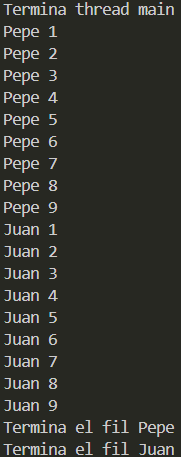
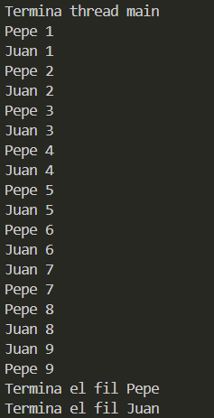

# M9 UF2 Act1 Daniel Acosta Garcia
## Comportament 1

#### Principal:
``` java
public class Principal {
    public static void main(String[] args) {
        Fil filJuan = new Fil("Juan");
        Fil filPepe = new Fil("Pepe");
        filJuan.start();
        filPepe.start();
        System.out.println("Termina thread main");
    }
}
```
### Fil:
``` java
public class Fil extends Thread {
    private String nom;
    public Fil(String nom) {
        this.nom = nom;
    }
    @Override
    public void run() {
        for (int i = 0; i <= 9; i++) {
            System.out.printf("%s %d \n", nom, i);
        }
        System.out.println("Termina el fil " + nom);
    }
}
```
### Execusio:



## Comportament 2

### Principal:
``` java
public class Principal {
    public static void main(String[] args) {
        Fil filJuan = new Fil("Juan");
        Fil filPepe = new Fil("Pepe");
        filJuan.setPriority(10);
        filPepe.setPriority(1);
        filPepe.start();
        filJuan.start();
        System.out.println("Termina thread main");
    }
}
```
### Fil:
``` java
public class Fil extends Thread {
    private String nom;
    public Fil(String nom) {
        this.nom = nom;
    }
    @Override
    public void run() {
        for (int i = 1; i <= 9; i++) {
            System.out.printf("%s %d \n", nom, i);
        }
        System.out.println("Termina el fil " + nom);
    }
}
```
### Execusio:


## Comportament 3

### Principal:
``` java
public class Principal {
    public static void main(String[] args) {
        Fil filJuan = new Fil("Juan");
        Fil filPepe = new Fil("Pepe");
        filJuan.setPriority(1);
        filPepe.setPriority(1);
        filPepe.start();
        filJuan.start();
        System.out.println("Termina thread main");
    }
}
```
### Fil:
``` java
public class Fil extends Thread {
    private String nom;
    public Fil(String nom) {
        this.nom = nom;
        setName(nom);
    }
    @Override
    public void run() {
        for (int i = 1; i <= 9; i++) {
            System.out.printf("%s %d \n", nom, i);
            try {
                Thread.sleep(100);
            } catch (InterruptedException e) {
                e.printStackTrace();
            }
        }
        System.out.println("Termina el fil " + nom);
    }
}
```
### Execusio:
